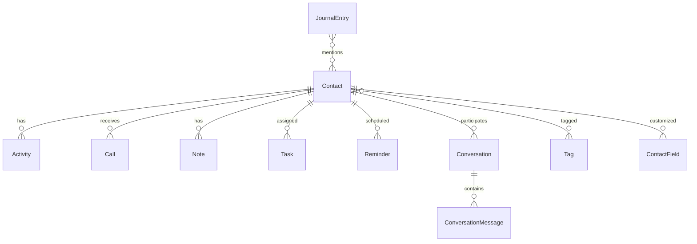

# Data Model: MonicaHQ MCP Server

**Feature**: MonicaHQ MCP Server Integration  
**Date**: 2025-09-13  
**Version**: 1.0.0

## Overview
This document defines the data entities, their relationships, and validation rules for the MCP server that interfaces with MonicaHQ CRM.

**Scope**: MonicaHQ provides 29 different API endpoints. This specification focuses on the most commonly used entities for MCP integration, with the ability to expand to all endpoints as needed.

## Core Entities

### 1. Contact
**Purpose**: Represents a person in the CRM system  
**Source**: MonicaHQ API `/api/contacts`

| Field | Type | Required | Validation | Description |
|-------|------|----------|------------|-------------|
| id | Long | Yes (response) | Auto-generated | Unique identifier |
| firstName | String | Yes | Max 255 chars | Person's first name |
| lastName | String | No | Max 255 chars | Person's last name |
| nickname | String | No | Max 255 chars | Preferred name |
| genderId | Long | Yes | Valid gender ID | Gender identifier (required) |
| isBirthdateKnown | Boolean | Yes | Default false | Whether birthdate is known |
| isDeceased | Boolean | Yes | Default false | Whether person is deceased |
| isDeceasedDateKnown | Boolean | Yes | Default false | Whether death date is known |
| email | String | No | Valid email, unique | Primary email address |
| phone | String | No | Valid phone format | Primary phone number |
| birthdate | Date | No | Past date | Date of birth |
| address | Address | No | Valid address | Physical address |
| company | String | No | Max 255 chars | Current employer |
| jobTitle | String | No | Max 255 chars | Current position |
| tags | List<Tag> | No | Valid tag IDs | Associated tags |
| createdAt | DateTime | Yes (response) | Auto-generated | Creation timestamp |
| updatedAt | DateTime | Yes (response) | Auto-generated | Last update timestamp |

### 2. Activity
**Purpose**: Records interactions and events with contacts  
**Source**: MonicaHQ API `/api/activities`

| Field | Type | Required | Validation | Description |
|-------|------|----------|------------|-------------|
| id | Long | Yes (response) | Auto-generated | Unique identifier |
| contactId | Long | Yes | Valid contact ID | Associated contact |
| type | String | Yes | Enum: call/meeting/email | Activity type |
| summary | String | Yes | Max 500 chars | Brief description |
| description | Text | No | Max 5000 chars | Detailed notes |
| date | DateTime | Yes | Any valid date | When it occurred |
| duration | Integer | No | 0-1440 (minutes) | Duration in minutes |

### 3. Call
**Purpose**: Tracks phone call records  
**Source**: MonicaHQ API `/api/calls`

| Field | Type | Required | Validation | Description |
|-------|------|----------|------------|-------------|
| id | Long | Yes (response) | Auto-generated | Unique identifier |
| contactId | Long | Yes | Valid contact ID | Associated contact |
| calledAt | DateTime | Yes | Any valid date | Call timestamp |
| duration | Integer | No | 0-1440 (minutes) | Call duration |
| type | String | Yes | Enum: incoming/outgoing | Call direction |
| content | Text | No | Max 5000 chars | Call notes |

### 4. Note
**Purpose**: Free-form text annotations for contacts  
**Source**: MonicaHQ API `/api/notes`

| Field | Type | Required | Validation | Description |
|-------|------|----------|------------|-------------|
| id | Long | Yes (response) | Auto-generated | Unique identifier |
| contactId | Long | Yes | Valid contact ID | Associated contact |
| body | Text | Yes | Max 10000 chars | Note content |
| isFavorite | Boolean | No | Default false | Starred note |
| createdAt | DateTime | Yes (response) | Auto-generated | Creation timestamp |

### 5. Task
**Purpose**: To-do items and action items  
**Source**: MonicaHQ API `/api/tasks`

| Field | Type | Required | Validation | Description |
|-------|------|----------|------------|-------------|
| id | Long | Yes (response) | Auto-generated | Unique identifier |
| contactId | Long | No | Valid contact ID | Associated contact |
| title | String | Yes | Max 255 chars | Task description |
| description | Text | No | Max 5000 chars | Additional details |
| completed | Boolean | No | Default false | Completion status |
| completedAt | DateTime | No | When completed | Completion timestamp |
| dueDate | Date | No | Future date | Due date |

### 6. Tag
**Purpose**: Labels for categorizing contacts  
**Source**: MonicaHQ API `/api/tags`

| Field | Type | Required | Validation | Description |
|-------|------|----------|------------|-------------|
| id | Long | Yes (response) | Auto-generated | Unique identifier |
| name | String | Yes | Max 50 chars, unique | Tag label |
| color | String | No | Hex color code | Display color |
| contactCount | Integer | Yes (response) | >= 0 | Number of contacts |

### 7. Reminder
**Purpose**: Scheduled notifications  
**Source**: MonicaHQ API `/api/reminders`

| Field | Type | Required | Validation | Description |
|-------|------|----------|------------|-------------|
| id | Long | Yes (response) | Auto-generated | Unique identifier |
| contactId | Long | Yes | Valid contact ID | Associated contact |
| title | String | Yes | Max 255 chars | Reminder text |
| description | Text | No | Max 5000 chars | Additional details |
| date | Date | Yes | Future date | Reminder date |
| frequency | String | No | Enum: once/weekly/monthly/yearly | Recurrence pattern |

### 8. JournalEntry
**Purpose**: Diary-style entries about contacts  
**Source**: MonicaHQ API `/api/journal`

| Field | Type | Required | Validation | Description |
|-------|------|----------|------------|-------------|
| id | Long | Yes (response) | Auto-generated | Unique identifier |
| title | String | Yes | Max 255 chars | Entry title |
| content | Text | Yes | Max 10000 chars | Entry body |
| date | Date | Yes | Any valid date | Entry date |
| contactIds | List<Long> | No | Valid contact IDs | Related contacts |

### 9. Conversation
**Purpose**: Message threads with contacts  
**Source**: MonicaHQ API `/api/conversations`

| Field | Type | Required | Validation | Description |
|-------|------|----------|------------|-------------|
| id | Long | Yes (response) | Auto-generated | Unique identifier |
| contactId | Long | Yes | Valid contact ID | Associated contact |
| subject | String | No | Max 255 chars | Thread subject |
| createdAt | DateTime | Yes (response) | Auto-generated | Creation timestamp |
| messages | List<Message> | No | Valid messages | Thread messages |

### 10. ConversationMessage
**Purpose**: Individual messages in conversations  
**Source**: Nested in Conversation

| Field | Type | Required | Validation | Description |
|-------|------|----------|------------|-------------|
| id | Long | Yes (response) | Auto-generated | Unique identifier |
| conversationId | Long | Yes | Valid conversation ID | Parent conversation |
| content | Text | Yes | Max 5000 chars | Message text |
| writtenAt | DateTime | Yes | Any valid date | Message timestamp |
| sentByMe | Boolean | Yes | Default true | Message direction |

### 11. ContactField
**Purpose**: Custom field definitions  
**Source**: MonicaHQ API `/api/contactfields`

| Field | Type | Required | Validation | Description |
|-------|------|----------|------------|-------------|
| id | Long | Yes (response) | Auto-generated | Unique identifier |
| name | String | Yes | Max 100 chars | Field name |
| type | String | Yes | Enum: text/number/date/select | Field type |
| required | Boolean | No | Default false | Is required |
| options | List<String> | No | For select type | Available options |

### 12. ContactTag (Relationship)
**Purpose**: Many-to-many relationship between contacts and tags  
**Source**: Managed through contact operations

| Field | Type | Required | Validation | Description |
|-------|------|----------|------------|-------------|
| contactId | Long | Yes | Valid contact ID | Contact reference |
| tagId | Long | Yes | Valid tag ID | Tag reference |
| createdAt | DateTime | Yes (response) | Auto-generated | Association timestamp |

## Extended Entities (Available but not in core MCP)

### 13. Company
**Purpose**: Business entities associated with contacts  
**Source**: MonicaHQ API `/api/companies`

### 14. Gift
**Purpose**: Track gifts given/received  
**Source**: MonicaHQ API `/api/gifts`

### 15. Document
**Purpose**: File attachments for contacts  
**Source**: MonicaHQ API `/api/documents`

### 16. Photo
**Purpose**: Images associated with contacts  
**Source**: MonicaHQ API `/api/photos`

### 17. Address
**Purpose**: Physical locations for contacts  
**Source**: MonicaHQ API `/api/addresses`

### 18. Relationship
**Purpose**: How contacts are related to each other  
**Source**: MonicaHQ API `/api/relationships`

### 19. Debt
**Purpose**: Track money owed/borrowed  
**Source**: MonicaHQ API `/api/debts`

### 20. Group
**Purpose**: Organize contacts into groups  
**Source**: MonicaHQ API `/api/groups`

### 21. User
**Purpose**: System users and permissions  
**Source**: MonicaHQ API `/api/users`

**Note**: These extended entities are available through MonicaHQ's API but not included in the initial MCP implementation scope. They can be added as additional MCP tools in future versions.

## Entity Relationships



## State Transitions

### Task States
```
pending -> completed (when marked done)
completed -> pending (when reopened)
```

### Reminder States
```
scheduled -> triggered (when date reached)
triggered -> dismissed (when acknowledged)
triggered -> snoozed -> scheduled (when postponed)
```

## Validation Rules

### Cross-Entity Validations
1. **Contact Deletion**: Check for dependent entities (activities, notes, tasks)
2. **Tag Deletion**: Verify no contacts are using the tag
3. **Conversation Creation**: Contact must exist
4. **Task Assignment**: Contact must exist if contactId provided

### Business Rules
1. **Duplicate Contacts**: Warn if name + email combination exists
2. **Reminder Dates**: Must be in the future for new reminders
3. **Task Due Dates**: Warn if in the past
4. **Call Duration**: Cannot exceed 24 hours (1440 minutes)

## MCP Protocol Mapping

### Operation Types
Each entity supports standard MCP operations:
- `create_{entity}`: POST to MonicaHQ
- `get_{entity}`: GET by ID
- `update_{entity}`: PUT/PATCH 
- `delete_{entity}`: DELETE
- `list_{entity}`: GET with pagination (default 10 items, max 100)

### Error Codes
| Code | Description | MCP Response |
|------|-------------|--------------|
| 404 | Entity not found | `entity_not_found` |
| 409 | Duplicate entity | `duplicate_entity` |
| 422 | Validation failed | `validation_error` |
| 429 | Rate limit exceeded | `rate_limit` |
| 500 | Server error | `internal_error` |

## API Specification Updates (2024)

### Verified Endpoints
- ✅ `/api/contacts` - Full CRUD + List operations
- ✅ `/api/activities` - Full CRUD + List operations  
- ✅ `/api/notes` - Full CRUD + List operations
- ✅ `/api/reminders` - Full CRUD + List operations

### Requires Verification
- ⚠️ `/api/calls` - Endpoint existence needs confirmation
- ⚠️ `/api/tasks` - Endpoint existence needs confirmation
- ⚠️ `/api/tags` - Endpoint existence needs confirmation
- ⚠️ `/api/journal` - Endpoint existence needs confirmation
- ⚠️ `/api/conversations` - Endpoint existence needs confirmation
- ⚠️ `/api/contactfields` - Endpoint existence needs confirmation

### Authentication Requirements
- OAuth2 Bearer token in Authorization header
- Format: "Authorization: Bearer OAUTH-TOKEN"
- Rate limit: 60 requests per minute

## Data Migration Considerations

### Future Enhancements
1. **Bulk Operations**: Batch create/update capabilities
2. **Data Export**: Full backup/restore functionality
3. **Field Mapping**: Custom field synchronization
4. **Attachment Support**: File upload/download for contacts

---
*Data model updated with 2024 API specifications. Some endpoints require verification before implementation.*